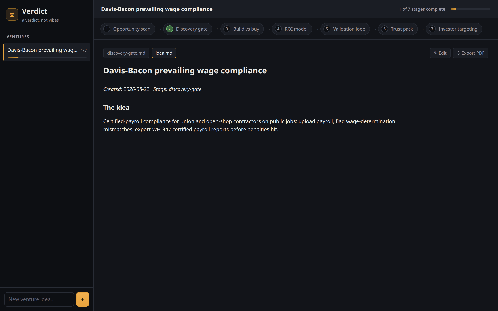

# Verdict

**Run your startup idea through a venture pipeline. Leave with a verdict, not vibes.**



Verdict is a local-first CLI and web GUI that runs your idea through seven stages of real venture methodology — the kind of scoring, kill rules, and evidence bars an investor applies before you ever meet one:

```
opportunity-scan → discovery-gate → build-vs-buy → roi-model
→ validation-loop → trust-pack → investor-targeting
```

Every stage produces a document with a decision in it: **Pursue / Hold / Killed**, **Build now / Scope first / Kill**, **iterate / pivot / stop**. Killed ideas are evidence of rigor, not wasted work.

## Why

Most idea tools flatter you. Verdict's methodology is built around kill rules: pain that can't be stated in dollars kills the idea; a moat any competitor ships in a weekend kills the idea; thresholds are set *before* the data comes in so results can't be rationalized afterward. The methodology lives in plain-Markdown skill files you can read, audit, and fork — the app is the harness that runs them.

## Quickstart

Requires Node 20+ and [Claude Code](https://claude.com/claude-code) (agentic stages run through the `claude` CLI on your existing subscription — no separate API key needed; deterministic commands like `scan` and `gate` run fully offline).

```bash
git clone <repo-url> && cd verdict
npm install && npm run build

# 1. Create a workspace for your idea
node dist/index.js init "AI payroll compliance for contractors"

# 2. Score candidate ideas on the six-axis rubric (offline, deterministic)
node dist/index.js scan examples/candidates.json

# 3. Face the five-question discovery gate (offline, interactive)
node dist/index.js gate ai-payroll-compliance-for-contractors

# 4. Run a full agentic stage (uses the claude CLI)
node dist/index.js run opportunity-scan ai-payroll-compliance-for-contractors \
  "Research and score this idea per the register structure"

# 5. Or do all of it in the GUI — pipeline view, gate as a form, documents rendered
node dist/index.js gui
```

## The six-axis rubric

Each idea is scored 1–5 per axis, weighted: **pain 25%**, **moat 20%**, **evidence velocity 20%**, **buyer reachability 15%**, **capital efficiency 10%**, **non-dilutive fit 10%**. Score ≥ 3.75 = Pursue, ≥ 3.00 = Hold, else Pass. Pain = 1 or moat = 1 kills outright, regardless of total.

See a real output: [`examples/register.reference.md`](examples/register.reference.md) — 11 ideas scored, one Pursue.

## State is files

Each idea lives in `ventures/<slug>/` as plain Markdown and JSON. No database, no accounts, no telemetry. `git init` your ventures folder if you want history.

## Status

v0.3 — CLI plus a local web GUI (`verdict gui`): project sidebar, pipeline view with per-stage status, the discovery gate as a form, opportunity scoring in the browser, agentic stages with live streamed output, rendered documents with in-place editing (fill in your assumption ledger where it lives), and PDF export via the print view. Everything stays on 127.0.0.1. See [`SPEC.md`](SPEC.md).

## License

MIT
